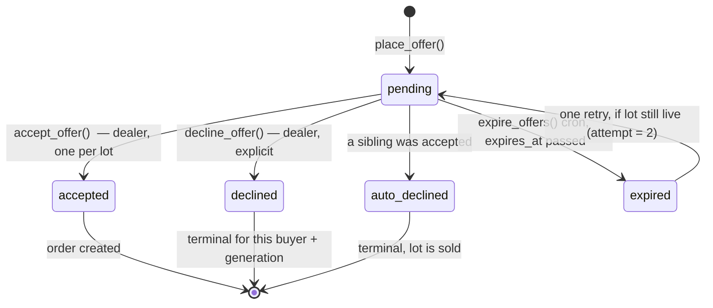

# OFFER_ENGINE.md — the one-shot offer

This is the product. Everything else is packaging. Read this before touching
`supabase/migrations/*_offer_engine.sql` or anything under `src/server/actions/offers.ts`.

## The rule

> A buyer gets **one** offer on a lot. One number. The dealer sees Accept or Decline.
> There is no counter, no edit, no raise, no withdraw, and no message thread until
> an offer is accepted.

## Why each guardrail exists

| Guardrail | Without it |
|---|---|
| One offer per buyer per lot generation | Buyers lowball, then creep up. That is an auction with extra steps. |
| No counter-offers | Dealers counter everyone, buyers wait to be countered, nobody ever leads with a real number. |
| No pre-acceptance messaging | The thread becomes the negotiation and the offer becomes a formality. |
| **Buyers cannot see competing amounts** | Live price discovery. It becomes eBay. This is enforced in RLS, not in the UI. |
| Offers are binding on the buyer | Free options. Buyers spray offers across 40 lots and honor whichever still looks good. |
| Offers expire on a schedule | Dealers sit on offers indefinitely and buyers' capital is frozen. |

The one softening: **an expired offer earns exactly one retry**, if the lot is still live.
An expiry is the dealer's inaction, so the buyer should not be punished for it. A *decline* is
a decision, and it is terminal.

## State machine

Attempt accounting, per `(lot_id, buyer_id, lot_generation)`:

| History | Can offer? | Resulting attempt |
|---|---|---|
| nothing | yes | 1 |
| one `expired` | yes | 2 |
| two `expired` | no — `RETRY_ALREADY_USED` | — |
| any `pending` | no — `ALREADY_OFFERED` | — |
| any `declined` / `auto_declined` / `accepted` | no — `ALREADY_OFFERED` | — |

`relist_lot()` bumps `lots.generation`, which resets this table for everyone. It is the only
sanctioned reset.

## Concurrency

Every mutating function takes `SELECT ... FROM lots WHERE id = ? FOR UPDATE` **before** it
reads offer state. This is not optional.

The race that will actually happen: a dealer has the inbox open in two tabs and clicks Accept
on two different offers within the same second. Without the lock, both transactions read
`lot.status = 'live'` and both create an order. With it, the second blocks, then re-reads and
fails on `LOT_NOT_LIVE`.

Belt and braces on top of the lock:

- `offers_one_accepted_per_lot_idx` — partial unique index, at most one `accepted` row per
  `(lot_id, lot_generation)`. If the lock is ever bypassed, this still holds the line.
- `offers_one_live_per_buyer_idx` — partial unique index, at most one `pending` row per
  `(lot_id, buyer_id, lot_generation)`.
- `orders.offer_id` is `UNIQUE`. One offer can never produce two orders.

**There is no RLS INSERT or UPDATE policy on `offers`.** Writes go through the `SECURITY
DEFINER` functions or they do not happen. Skipping them would skip the lock and the eligibility
checks. If you find yourself wanting to write `supabase.from('offers').insert(...)`, stop.

## `accept_offer()` — what happens, in order

1. Lock the lot row.
2. Re-read the offer under the lock.
3. Authorize: caller owns the lot's company.
4. Validate: offer is `pending`, not past `expires_at`, lot is `live`.
5. Offer → `accepted`, `decided_at = now()`.
6. **All sibling `pending` offers on this generation → `auto_declined`.**
7. Lot → `sold`, `sold_at = now()`.
8. Insert the order: reference, amounts, `platform_fee_cents` from `platform_settings.fee_bps`,
   `payment_due_at = now() + payment_due_days`.
9. Notify the winner (`offer.accepted`) and every loser (`offer.auto_declined`).

One transaction. Any failure rolls back all nine steps.

## Expiry

Offers expire on a **schedule, never lazily on read**. A buyer must never load a page and
discover their offer died three hours ago and nobody told them.

`/api/cron/expire-offers` calls `expire_offers()` every 5 minutes, guarded by
`Authorization: Bearer $CRON_SECRET`. It does two things:

- `pending` offers past `expires_at` → `expired`, plus an `offer.expired` notification.
- `live` lots past `closes_at` → `expired`.

An offer's `expires_at` is `least(now() + lot.offer_window_hours, lot.closes_at)`. An offer
placed 2 hours before a lot closes gets 2 hours, not 48.

## Error codes → copy

`place_offer()` raises stable string codes. `src/lib/errors.ts` maps them to the strings in
`docs/COPY.md`. Never surface a raw Postgres message.

| Code | SQLSTATE | User-facing |
|---|---|---|
| `AUTH_REQUIRED` | 28000 | Sign in to make an offer. |
| `ACCOUNT_SUSPENDED` | P0001 | Your account is suspended. Contact support. |
| `LOT_NOT_FOUND` | P0002 | This lot no longer exists. |
| `LOT_NOT_LIVE` | P0003 | This lot is no longer taking offers. |
| `LOT_CLOSED` | P0004 | Offers closed on this lot. |
| `CANNOT_OFFER_ON_OWN_LOT` | P0005 | You can't offer on your own lot. |
| `INVALID_AMOUNT` | P0006 | Enter an amount above $0. |
| `QUANTITY_EXCEEDS_LOT` | P0007 | That's more units than the lot holds. |
| `WHOLE_LOT_ONLY` | P0008 | This lot sells whole only. |
| `PICKUP_NOT_OFFERED` | P0009 | This dealer doesn't offer pickup. |
| `ALREADY_OFFERED` | P0010 | You've already offered on this lot. One offer per lot. |
| `RETRY_ALREADY_USED` | P0011 | You've used both offers on this lot. |
| `OFFER_NOT_FOUND` | P0012 | That offer no longer exists. |
| `OFFER_NOT_PENDING` | P0013 | This offer was already decided. |
| `OFFER_EXPIRED` | P0014 | This offer expired before you could accept it. |
| `NOT_YOUR_LOT` | 42501 | You don't have access to this lot. |
| `LOT_NOT_RELISTABLE` | P0015 | Only expired or removed lots can be relisted. |

## The confirmation UX

The highest-stakes screen in the product. It must feel like signing, not like dismissing.

**Enter:** 400ms, `cubic-bezier(.22,1,.36,1)`, `scale(.97) → 1`, backdrop fades to
`rgba(33,29,25,.5)` with `blur(3px)`. Slower than every other modal in the app on purpose.

**Content, top to bottom:**
1. The amount, large, in `Instrument Serif` — the number is the subject. **No warning triangle**
   (BRAND.md §11(g)); an alert icon reads as *you made a mistake*, and this is a commitment.
2. `One offer. No going back.` — H2.
3. `If {dealer} accepts, this becomes a binding order. You cannot edit, raise or withdraw it,
   and you will not get a second offer on this lot.`
4. A bordered summary: lot, your offer, % of asking, fulfillment, expires.
5. Checkbox: `I understand this offer is binding and final.`

**Unlock:** the submit button enables on checkbox **and** a 600ms dwell after the modal
settles. Nobody muscle-memories through a binding commitment. Track the dwell from
animation-end, not from mount.

**Submit:** button label is `Submit $6,100` — the number is in the button, so the last thing
under the cursor is the commitment. In-flight it becomes a spinner and the modal is
non-dismissible; a double-submit must not create two offers (the unique index would catch it,
but the user should never see that error).

**Keyboard:** focus moves to the modal container on open, is trapped, Esc closes (it is
reversible until submit), Tab order is checkbox → Submit → Back. Focus returns to the "Review
offer" button on close.

**Reduced motion:** no scale, no border sweep, no blur — a plain 120ms opacity fade. The 600ms
dwell still applies; it is a safety interlock, not decoration.

## The decline moment

DESIGN_PROMPT calls this "the worst moment in the product — make it not feel humiliating."

Rules:

- **The word is "Declined."** Never "Rejected", never "Unsuccessful", never "Sorry".
- **It is not red.** `ink-600` on `sand-100`, neutral dot — the same weight as "Expired".
  Red belongs to disputes and destructive actions. (BRAND.md §11(i).)
- No apology copy. No "unfortunately". No emoji.
- Immediately below, the coaching card, from `offer_outcomes` and `category_clearing_stats`:
  `Two of your offers were beaten by under $300. Accepted offers in Mixed Lots ran 12–18%
  above yours last month. Median accepted discount was 83% off retail.`
- Then three live lots in the same category, sorted by closing soonest. The next move is
  always on screen.
- `auto_declined` reads as **"Not selected"**, not "Declined". The buyer did nothing wrong;
  somebody else simply bid more. The distinction is small and it matters.

## Test cases that must pass before this ships

Concurrency (integration, real Postgres — not mocks):
1. Two concurrent `accept_offer` calls on two different offers of the same lot → exactly one
   order, the other raises `LOT_NOT_LIVE`.
2. Two concurrent `place_offer` calls from the same buyer on the same lot → exactly one
   `pending` row.
3. `accept_offer` racing `expire_offers` past `expires_at` → `OFFER_EXPIRED`, no order.

Eligibility:
4. Second offer while one is `pending` → `ALREADY_OFFERED`.
5. Offer after `declined` → `ALREADY_OFFERED`.
6. Offer after one `expired`, lot still live → succeeds, `attempt = 2`.
7. Offer after two `expired` → `RETRY_ALREADY_USED`.
8. Offer after `relist_lot()` → succeeds, `attempt = 1`, new generation.
9. Dealer offering on their own lot → `CANNOT_OFFER_ON_OWN_LOT`.

Cascade:
10. Accept 1 of 5 → 1 `accepted`, 4 `auto_declined`, lot `sold`, 1 order, 5 notifications.

Isolation (the one that protects the thesis):
11. Buyer A queries `offers` for a lot where B also offered → sees only their own row.
12. Anonymous client queries `offers` → zero rows.
13. Dealer queries `offers` on a lot they do not own → zero rows.

Money:
14. `platform_fee_cents` = `amount_cents * fee_bps / 10000`, integer division, no float
    anywhere in the path.
